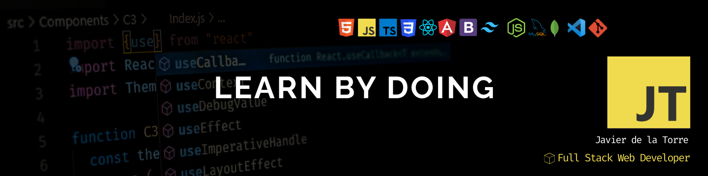
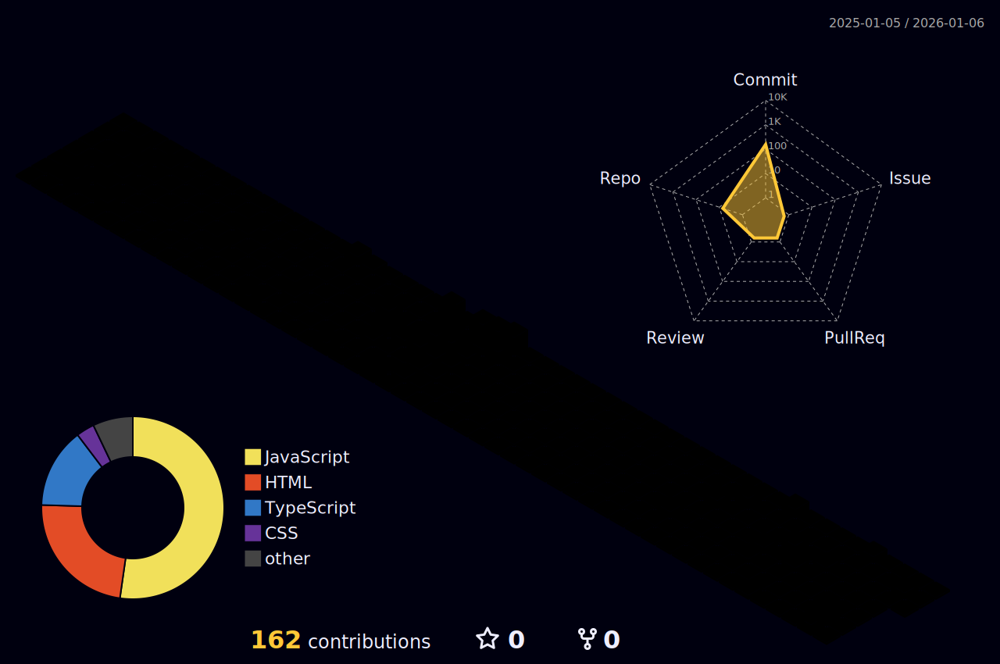

<h1 align="center">Hola, soy Javier</h1>

  

Desarrollador Web — construyendo productos accesibles, rápidos y mantenibles.

---

Idioma: <a href="./README.en.md">English</a> · <a href="./README.es.md">Español</a>

## Sobre mí

👋 ¡Hola! Soy Javier. Me apasiona el desarrollo web y el reto de crear aplicaciones en todas sus dimensiones. Mi experiencia como Maquetador Front‑end Freelance me aporta una base sólida en fundamentos UX/UI y en el trato directo con clientes. Mi hoja de ruta de formación continuada se enfoca en Arquitectura de despliegue y CI/CD, Ecosistema de IA aplicada, Diseño avanzado de interfaces y UX con animaciones dinámicas, y Rendimiento y Web Vitals.

Busco la mejora continua para ofrecer un mejor servicio a mis equipos, empleadores y usuarios finales. Me caracterizan la colaboración en equipo, el aprendizaje continuo, la autonomía orientada a la resolución y la atención al detalle. Quiero consolidar mi carrera como Full Stack Developer en un equipo donde aprender de los mejores y aportar valor desde el primer día. Si crees que encajo en tu proyecto o tienes sugerencias para mi etapa de crecimiento, ¡estaré encantado de charlar!

## Contacto

## Habilidades

**Front-End**: 

**Back-End**:

**Bases de datos**:

**Herramientas**: 

**CMS**: 

## Proyectos destacados

### myBooks (Work in Progress) 

- **Propósito:** SPA para gestionar y explorar libros con búsqueda en Open Library, colecciones, favoritos y perfil de usuario.
- **Funcionalidades:** CRUD de libros y colecciones, filtros avanzados, importación desde API, rutas públicas/privadas y áreas sociales (foro, amigos, grupos).
- **Diseño:** responsive y mobile‑first, tema claro/oscuro, foco en UX/UI y rendimiento.
- **Stack:** React + TypeScript + Vite; UI con componentes propios (formularios accesibles, off‑canvas móvil), hooks personalizados (useBookListFilter, useTheme), ESLint.

---
### myBooks API    
- **Propósito:** API REST para gestionar libros y usuarios con persistencia y rutas dedicadas, lista para despliegue en plataformas serverless.
- **Funcionalidades:** CRUD de books y users, configuración por .env, manejo centralizado de errores y estructura modular de controladores y routers.
- **Despliegue:** arquitectura limpia orientada a mantenimiento, endpoints versionables, vercel.json para despliegue, y entorno reproducible para desarrollo.
- **Stack:** Node.js + Express, separación en app/index, capas controller, routers, models y gestión de conexión en database.

  
  
  
  
  

  
Ver más repositorios

  - Portfolio (GitHub Pages) — Sitio personal y landing estática en js Vanilla (Práctica).

  

  - myBooks (Angular) — Versión Angular con servicios, routing y formularios reactivos.
  
  

## Logros y formación

- **Full Stack Web Developer Bootcamp** - CodeNotch (2025)
- **Grado Superior en Desarrollo de Aplicaciones Web** - Medac (2024)

## Aprendiendo actualmente

- Patrones avanzados de TypeScript y perfilado de rendimiento.
- Estrategias de testing para aplicaciones front-end complejas.
- Buenas prácticas cloud-native.

## Actividad

---

  

